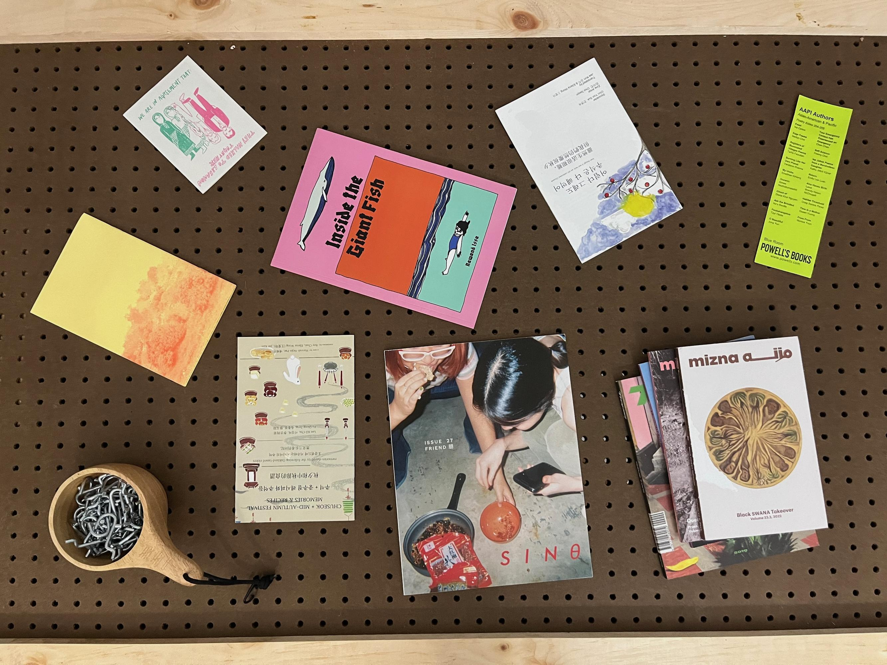
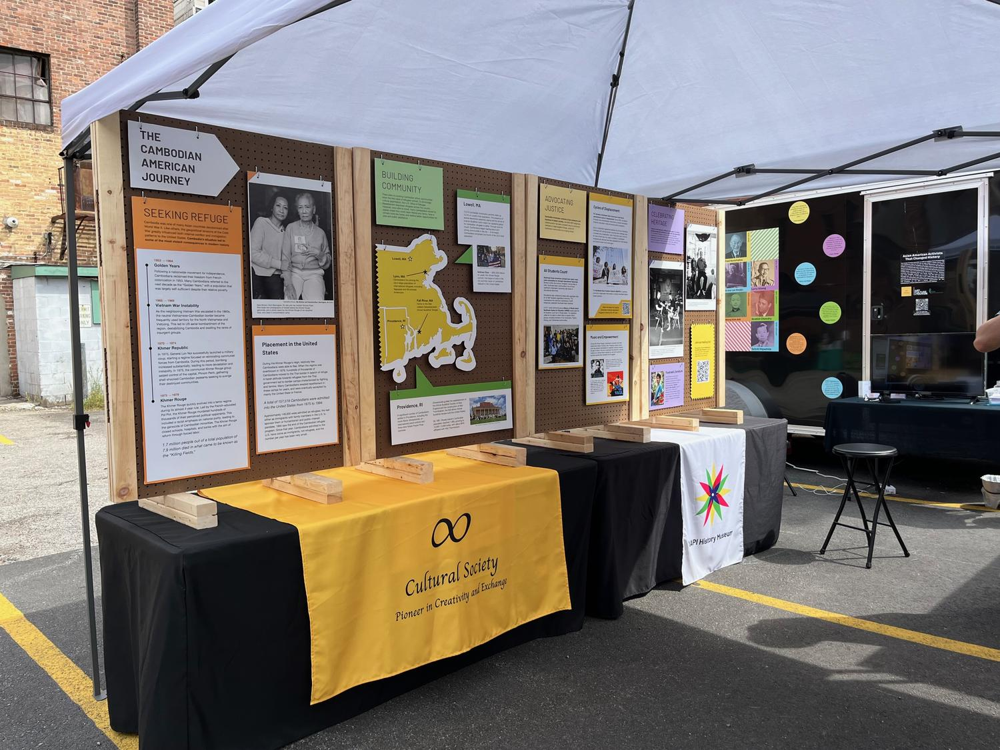
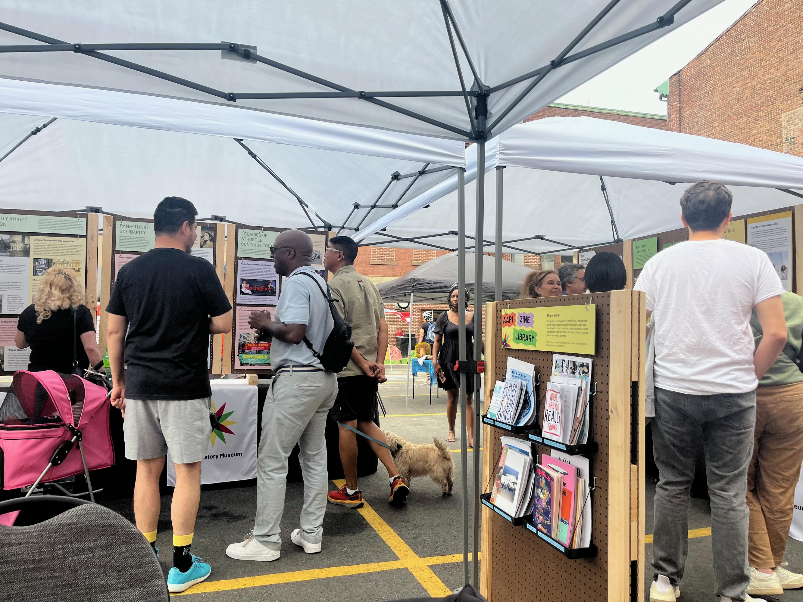

## AAPI Mobile History Museum

DURATION:  Summer 2024 (3 months)

SKILLS:  Product Design, Event Planning

POSITION:  Design Co-Lead (with Karen Hu)

</img>

### OVERVIEW

Two years ago, Rhode Island became the fourth state to require Asian American and Pacific Islander (AAPI) History in public schools. Newly mandated, but encapsulating the unique experiences of thousands of ethnic subgroups, we aimed to create a dynamic resource for schools and community centers to use to highlight local and global subgroup histories.
  
Informed by AAPI artists, researchers, and community members of all ages, Karen Hu and I designed and fabricated a travelling exhibition for the developing AAPI History Museum in Providence. With repurposable displays that can hold items like text panels, shelves, and whiteboards, what we created is just the beginning of a continuously expanded rotation of public history.

### DESIGN DETAILS    

</img>

Modular and Repurposable

- A main goal for the AAPI Mobile History Museum was that it would be able to travel to different community centers and rotate through highlights of different AAPI subgroups.
- We designed the panels to not only fit this purpose, but also to imply to viewers the dynamic nature of the exhibit.

  

</img>

Community Informed

- Central to the exhibit is the AAPI Zine Library that we launched and helped curate. 
- Platforming artists both local to Rhode Island and around the world, zines provide a tried-and-true medium for sharing underrepresented AAPI subgroup stories.

  

</img>

Collapsible and Transportable

- The stands for each of the boards are detachable so that the components can easily fit in a trailer or the bed of a truck.

### Special Thanks

Karen Hu
Sophara Eang
Kannetha Brown
Larry Zagorsky + the AS220 Staff
Jeannie Salomon
Professor Jeff Huang + the Brown CS Department
Samantha Ho
Carla Chen
Indigo Mudbhary
Lily Gucfa
Erin Wells
Salina Kuo
Vandy Chhoeun
Yoko Yamamoto