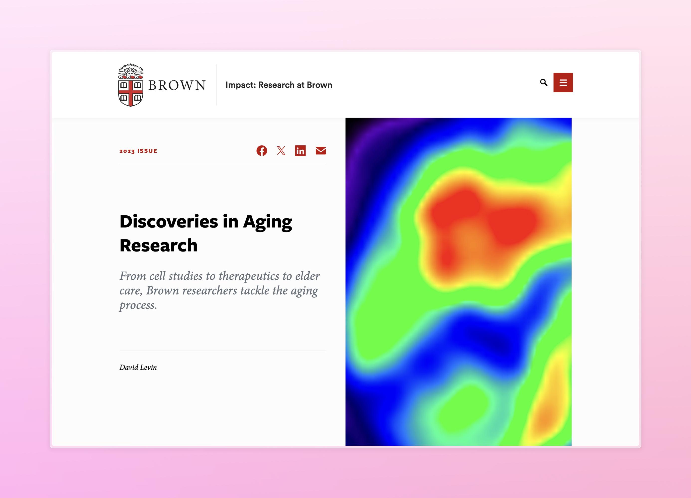

</img>

# brown.edu

<a class="clickable" href="https://brown.edu" target="_blank" rel="noopener noreferrer">Visit Site↗</a>

2025

    
Drupal

    
CMS

            
Accessibility

        
CSS

                
Design Systems

Working for the Brown Office of University Communications, I helped publish over 25 departmental websites and migrate over 600 pages of content for the university’s public-facing redesign. Managing content on such a large platform required sharp attention to detail, streamlined digital organization, and an emphasis on accessibility.

 

Producing web content at this scale of visibility not only taught me about professional web practices, but also gave me a better understanding of my university. College students are often overwhelmed by the amount of information that becomes missed in such an all-encompassing environment. I hope that in making sharp and easily navigable sites, I provided clarity for my student community.

 

Thank you to the OUC staff, namely Martin Bierer, Leslie Nevola, and Todd Skoglund for your mentorship!

  

