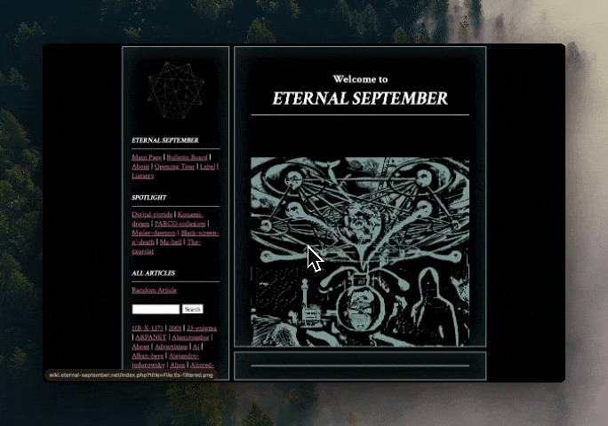

</img>

# Eternal September Wiki

<a class="clickable" href="https://wiki.eternal-september.net" target="_blank" rel="noopener noreferrer">Visit Site↗</a>

2025

    
PHP

    
CSS

        
JavaScript

                
Linux

                                
Web Art

As an assistant to William Brittelle, I am designing and programming a wiki for the collaborative hypermedia project, "Eternal September." By using PHP, JavaScript, and CSS, I am retrofitting and customizing <a href="https://www.mediawiki.org/wiki/MediaWiki" target="_blank" rel="noopener noreferrer">Wikipedia's public code</a> to fit the needs and aesthetics of the project.

