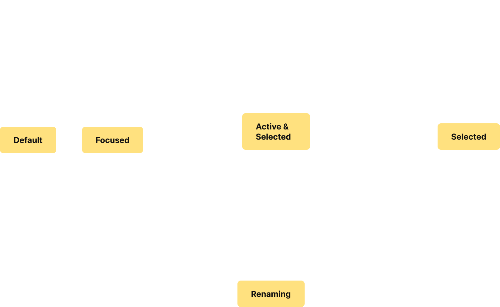

## VSCode

Designing a terminal theme customization system for software developers leveraging AI.

 

DURATION:  February 2025 (2 Weeks)

TOOLS:  Figma, Balsamiq

</img>

### Overview

Figma is the newest industry standard tool for designers of all kinds who work on web and mobile projects. As such, its interface is thoughtfully crafted as to give users an experience worth aspiring to create in their own projects.

 

I took a look at Figma's Layers Panel to see if there were any ways to improve an already excellent platform. It turns out that there is a great opportunity for improvement when comparing the nested accordion that Figma uses with other similar components used by commonplace applications.

  

    
    
Figma's Layers panel

  

  

    
    
Finder's file navigation

  

  

    
    
VSCode's Explorer panel

  

### INPUTS

  <table style="border-collapse: collapse; width: 100%; border: 1px solid grey;">
    <thead>
      <tr>
        <th style="border: 1px solid white; padding: 8px 12px;"></th>
        <th style="border: 1px solid white; padding: 8px 12px;">Figma</th>
        <th style="border: 1px solid white; padding: 8px 12px;">Finder</th>
        <th style="border: 1px solid white; padding: 8px 12px;">VSCode</th>
      </tr>
    </thead>
    <tbody>
      <tr>
        <th style="border: 1px solid white; padding: 8px 12px;">Mouse/Touchpad</td>
        <td style="border: 1px solid white; padding: 8px 12px;">
        
- Click arrow to expand/collapse layers/groups
- Click layer to select

// highlight and annotate the glaring renaming problems 

</td>
        <td style="border: 1px solid white; padding: 8px 12px;">
        
- Click triangle to expand/collapse folders
- Click file/folder to select/open

</td>
        <td style="border: 1px solid white; padding: 8px 12px;">
        
- Click arrow to expand/collapse folders
- Click file to open in editor

</td>
      </tr>
            <tr>
        <th style="border: 1px solid white; padding: 8px 12px;">Keyboard</td>
        <td style="border: 1px solid white; padding: 8px 12px;">
        
- ↑/↓ to move between layers
- → to expand (if collapsed), ← to collapse
- ⏎ to select

</td>
        <td style="border: 1px solid white; padding: 8px 12px;">

- ↑/↓ to move between items
- → to expand (list view), ← to collapse
- ⏎ to open

</td>
        <td style="border: 1px solid white; padding: 8px 12px;">
        
- ↑/↓ to move focus
- → to expand folder, ← to collapse
- ⏎ to open file

</td>
      </tr>
            <tr>
        <th style="border: 1px solid white; padding: 8px 12px;">Touch (if available)</td>
        <td style="border: 1px solid white; padding: 8px 12px;">
        
- Tap arrow to expand/collapse
- Tap layer to select (mobile app limited)

</td>
        <td style="border: 1px solid white; padding: 8px 12px;">
        
- Tap triangle to expand/collapse
- Tap to open file/folder (macOS/iPad with touch)

</td>
        <td style="border: 1px solid white; padding: 8px 12px;">
        
- Tap arrow to expand/collapse
- Tap file to open (on touch-enabled devices)

</td>
      </tr>
      <!-- Add more rows as needed -->
    </tbody>
  </table>

   

### OUTPUTS

  <table style="border-collapse: collapse; width: 100%; border: 1px solid grey;">
    <thead>
      <tr>
        <th style="border: 1px solid white; padding: 8px 12px;"></th>
        <th style="border: 1px solid white; padding: 8px 12px;">Figma</th>
        <th style="border: 1px solid white; padding: 8px 12px;">Finder</th>
        <th style="border: 1px solid white; padding: 8px 12px;">VSCode</th>
      </tr>
    </thead>
    <tbody>
      <tr>
        <th style="border: 1px solid white; padding: 8px 12px;">Mouse/Touchpad</td>
        <td style="border: 1px solid white; padding: 8px 12px;">
        
- Items include a grey hover state and light blue selected state
- Renaming state opens text editor view, with name fully selected

</td>
        <td style="border: 1px solid white; padding: 8px 12px;">
        
- Light grey hover state matches selected item state
- Selected state gives item blue background and bright border
- Renaming state initally selects text in front of file type suffix

</td>
        <td style="border: 1px solid white; padding: 8px 12px;">
        
- No visible hover state
- Renaming state initially selects text in front of file type suffix

</td>
      </tr>
            <tr>
        <th style="border: 1px solid white; padding: 8px 12px;">Keyboard</td>
        <td style="border: 1px solid white; padding: 8px 12px;">
        
- Focus state is light blue, matching selected state
- Renaming state looks consistent regardless of input method

</td>
        <td style="border: 1px solid white; padding: 8px 12px;">

- Instead of having a focus state, items are selected with keyboard navigation
- Renaming state behaves the same as with mouse input

</td>
        <td style="border: 1px solid white; padding: 8px 12px;">

- Focused state puts bright blue border around item, unique to keyboard use
- Renaming state uses consistent visual text editing, but background depends on selection status

</td>
        </tr>
            <tr>
        <th style="border: 1px solid white; padding: 8px 12px;">Screen Reader</td>
        <td style="border: 1px solid white; padding: 8px 12px;">
        
- Tap arrow to expand/collapse
- Tap layer to select (mobile app limited)

</td>
        <td style="border: 1px solid white; padding: 8px 12px;">
        
- Tap triangle to expand/collapse
- Tap to open file/folder (macOS/iPad with touch)

</td>
        <td style="border: 1px solid white; padding: 8px 12px;">
        
- Tap arrow to expand/collapse
- Tap file to open (on touch-enabled devices)

</td>
      </tr>
      <!-- Add more rows as needed -->
    </tbody>
  </table>

 

 

### state models

  <input type="radio" id="tabset1-before" name="tabset-1" checked>
  <input type="radio" id="tabset1-after" name="tabset-1">

  

    <label for="tabset1-before">Before</label>
    <label for="tabset1-after">After</label>
  

  

  #### Mouse Users

    

  

  

  #### Mouse Users

    

  
  

 

  <input type="radio" id="tabset2-before" name="tabset-2" checked>
  <input type="radio" id="tabset2-after" name="tabset-2">

  

    <label for="tabset2-before">Before</label>
    <label for="tabset2-after">After</label>
  

  

  #### Keyboard Users

    

  

  

  #### Keyboard Users

    

  
  

 

### a Revised accordion item

 

 

### Reflection

- The accordion items I observed to inform this project were successful through their simplicity. Transforming item names directly into text editors provides a direct visual metaphor for name replacement that seems to be universal across many applications. Because item renaming is so important, accessibility to both mouse and keyboard users (with varying efficiency) is always available.

- In examining how VSCode offers renaming via mouse, I recognized accessibility concerns in requiring readers to scan a large block of text in order to perform an important & somewhat frequent action.

- [Kat Holmes](https://www.youtube.com/watch?v=-iccWRhKZa8&ab_channel=99U) describes inclusive design as a relationship of "matches" and "mismatches" between people and their environments, as opposed to a fix for personal conditions. Making VSCode unintimidating through accessible and familiar navigation helps solve a common "mismatch" for people who believe coding is not "meant" for them.

### Future redesigns

- Renaming using a screenreader in Finder has inconsistencies between the text in the editor and what is read aloud. This has potential for negative impact on users who navigate primarily through audio.

- The renaming text editors in Figma, Finder, and VSCode usefully include double and triple clicking to select larger portions of text. It would be great to see this kind of efficiency made accessible to keyboard users.

- Although this case study focused on expanding mouse functionality, mouse users are usually the priority in the creation of these kinds of components, because they live in laptop-based applications. This often creates a mouse-centric user experience with negative effects for other types of users. It is important that redesigns inspired by this keep this in mind.

<!-- 

  <input type="radio" id="tab-before" name="tabset" checked>
  <input type="radio" id="tab-after" name="tabset">

  

    <label for="tab-before" role="tab" tabindex="0" aria-controls="panel-before">Before</label>
    <label for="tab-after" role="tab" tabindex="0" aria-controls="panel-after">After</label>
  

  

    

    

    
Mouse users

     
    

     
    

    
Keyboard users

     
        

        

        

  

    

    

    
Mouse users

     
    

     
    

    
Keyboard users

     
        

        

 -->

<!-- 

Augue efficitur sapien tincidunt aliquam fermentum nec habitant torquent vehicula. Nisi posuere ante aliquet ligula fames. Nec nunc metus tristique aenean volutpat eleifend. Amet viverra bibendum primis erat tempor sem nisl fermentum rutrum? Convallis primis odio cursus metus tristique. Varius commodo ultricies maximus class vivamus, malesuada conubia platea.

### My Solution
Magna natoque porttitor sollicitudin accumsan himenaeos pulvinar gravida. Fringilla ipsum lorem; eu dui rhoncus habitant tellus maecenas. Class tortor orci adipiscing tempus adipiscing ullamcorper. Varius velit cras condimentum enim netus nunc ut rhoncus. Facilisis phasellus cursus nascetur integer erat purus ridiculus vulputate. Hendrerit ac dolor et ut, blandit lorem rhoncus mollis vel. Facilisi nullam montes auctor ligula inceptos fusce. Nunc gravida lorem elementum; nascetur dignissim leo. Potenti molestie egestas nisl euismod purus vitae.

Fermentum laoreet venenatis malesuada pellentesque sit dictum sagittis. Tempus vehicula turpis integer finibus; suspendisse malesuada vestibulum. Turpis diam dis diam ad duis iaculis ridiculus nascetur. Hac varius curabitur; vestibulum quisque gravida aptent tristique hac. Ligula pretium porta nibh dui maximus inceptos litora porta. Suspendisse nunc litora nullam tortor iaculis ultrices eget. Justo ac cursus accumsan est, class tempor hendrerit id. Leo pulvinar leo nullam vitae nunc accumsan mi magnis euismod.

### Reflection

With the [social model of disability](https://www.youtube.com/watch?v=-iccWRhKZa8&ab_channel=99U) in mind, I did x y and z.

Fermentum aliquet taciti consequat eros accumsan nisl. Sollicitudin phasellus lorem nibh eros donec felis aptent massa. Nunc tempor nisi cubilia fames nisl. Gravida aenean porta lectus tempus eleifend tempor litora. Mus varius consectetur litora nascetur netus. Eget dictum et ornare curae mollis posuere. Gravida malesuada porta arcu aptent dictum turpis. Platea tortor tortor morbi ornare proin suspendisse est eget. At maximus gravida; interdum blandit est inceptos. Nec ex leo finibus fermentum faucibus at, nullam integer!
 -->
