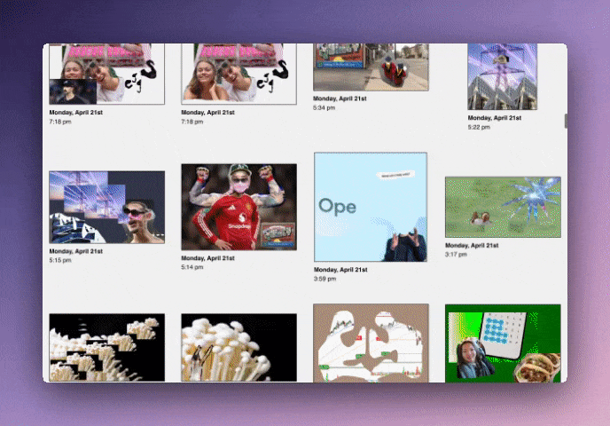

</img>

# We Collage

2025

    
React

    
Web Art

We Collage is a web art project that prompts users to creatively interpret trending Google search data through assembling collages. Once a collage is created, it can be submitted to an anonymous chronological public gallery.

I designed We Collage's interface to be transparently straightforward while mimicing the practice of collaging by hand. 

